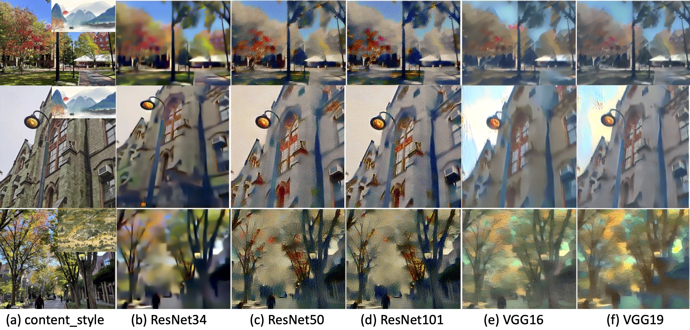
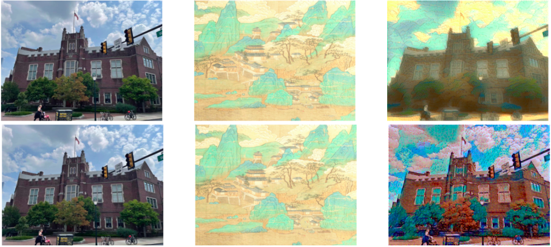
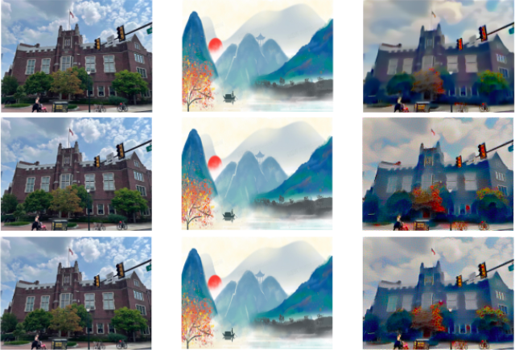
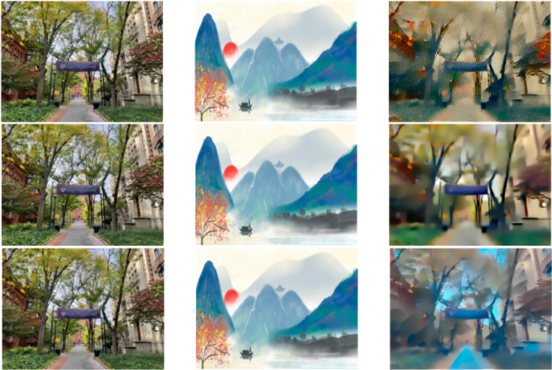

# StyleTransfer
CIS519 GroupWork

Group Member: Xi Cao, Yuxuan Li, Zheng Han

This is our group project for Upenn CIS 519 Applied Machine Learning.

### Abstract

We take the photographs of Upenn’s landscapes ourselves and download traditional Chinese paintings from open sources as the input to different machine learning algorithms (**KNN, Logistic Regression, VGG and ResNet**). The outputs are transferred images, i.e, Upenn's landscapes photographs with traditional Chinese painting style. As for evaluation, we will make a preliminary assessment by observing the results. More persuasively, the transferred image (produced by different algorithms) will be compared by crowdsourcing method, which enables other people to evaluate the generated art works. At last, we analyze the results.

### Results

And according to the result of crowdsourcing, we found that our best model received the most support for resemblance to Chinese painting. We also found that ResNet is overall faster than the VGG network.

| Candidate Network   | ResNet34 | ResNet50 | ResNet101 | VGG16  | VGG19   |
| ------------------- | -------- | -------- | --------- | ------ | ------- |
| Crowd evaluation(%) | 15.79%   | 39.34%   | 34.22%    | 52.63% | 60.53%  |
| Running time(s)     | 64.081   | 80.015   | 150.514   | 61.350 | 105.398 |

### Other beautiful generated pictures

